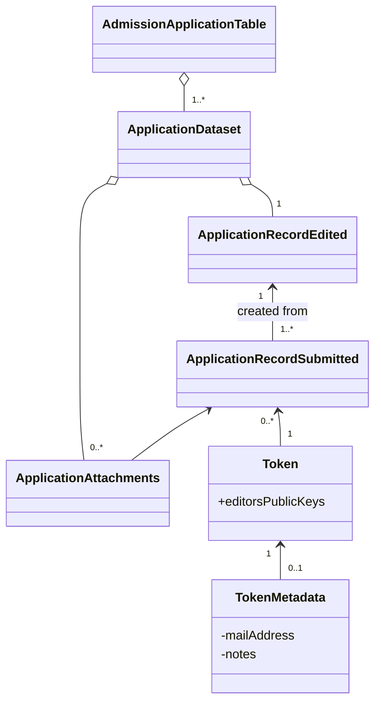

# DB Records + Files

```mermaid
classDiagram
     class AdmissionApplicationTable:::editorOnly
     class ApplicationDataset:::editorOnly
     class ApplicationRecordEdited:::editorOnly

     class ApplicationRecordSubmitted:::encrypted
     class ApplicationAttachments:::encrypted
     class TokenMetadata:::encrypted {
         -mailAddress
	 -notes
     }
     class Token:::public {
         +editorsPublicKeys
     }

     AdmissionApplicationTable o-- "1..*" ApplicationDataset
     ApplicationDataset o-- "1" ApplicationRecordEdited
     ApplicationDataset o-- "0..*" ApplicationAttachments

     ApplicationRecordEdited "1" <-- "1..*" ApplicationRecordSubmitted : created from
     ApplicationRecordSubmitted "1" <-- "0..*" ApplicationAttachments
     ApplicationRecordSubmitted "0..*" <-- "1" Token
     Token "1" <-- "0..1" TokenMetadata
```
