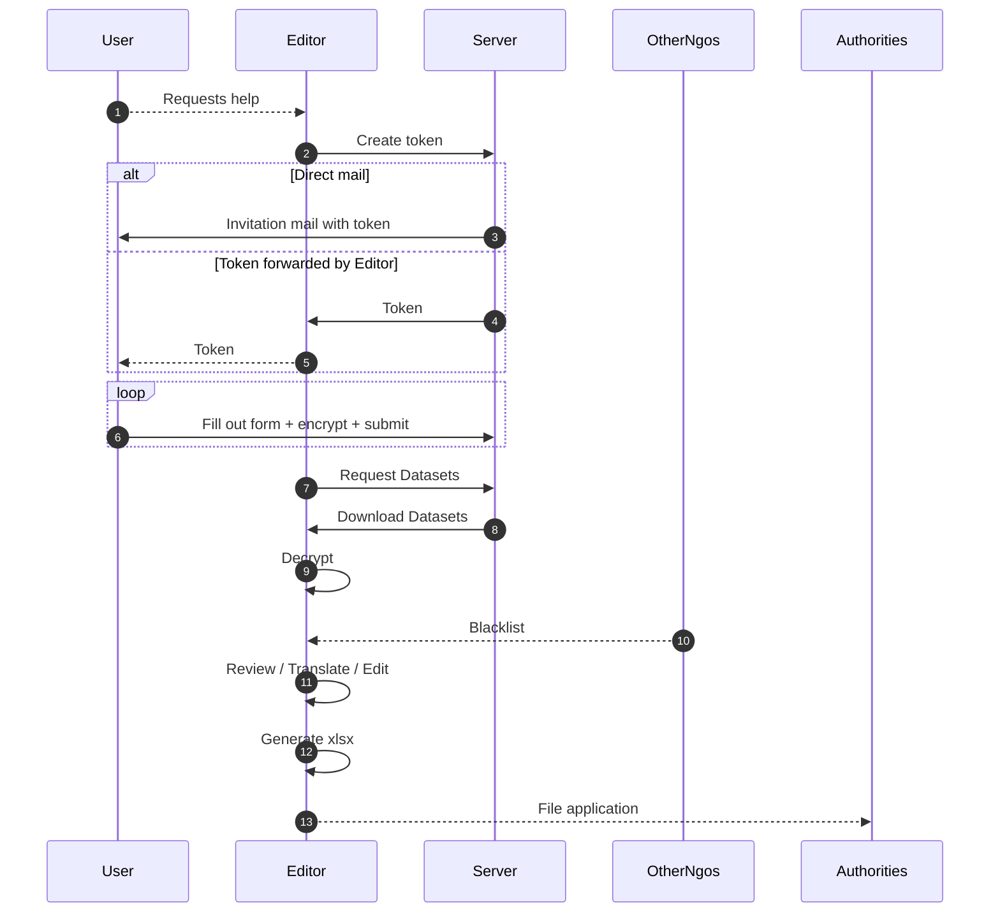

# Overview

```mermaid
sequenceDiagram
    autonumber
    #actor User
    #participant Server
    #actor Editor
    #actor OtherNgos
    #actor Authorities
    User-->>Editor: Requests help
    Editor->>Server: Create token
    alt Direct mail
        Server->>User: Invitation mail with token
    else Token forwarded by Editor
        Server->>Editor: Token
        Editor-->>User: Token
    end
    loop 
        User->>Server: Fill out form + encrypt + submit
    end
    Editor->>Server: Request Datasets
    Server->>Editor: Download Datasets
    Editor->>Editor: Decrypt
    OtherNgos-->>Editor: Blacklist
    Editor->>Editor: Review / Translate / Edit
    Editor->>Editor: Generate xlsx
    Editor-->>Authorities: File application
```
