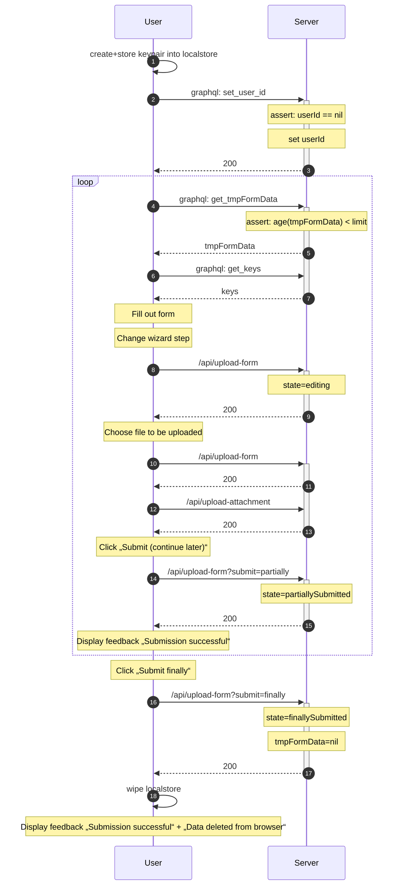

# Privacy friendly user sessions

```mermaid
sequenceDiagram
    autonumber
    #actor User
    #participant Server
    #actor Editor

    User->>User: create+store keypair into localstore

    User->>+Server: graphql: set_user_id
    Note over Server: assert: userId == nil
    Note over Server: set userId
    Server-->>-User: 200

    loop
        User->>+Server: graphql: get_tmpFormData
	Note over Server: assert: age(tmpFormData) < limit
        Server-->>User: tmpFormData

        User->>Server: graphql: get_keys
        Server-->>-User: keys

        Note over User: Fill out form

        Note over User: Change wizard step
        User->>+Server: /api/upload-form
	Note over Server: state=editing
        Server-->>-User: 200

        Note over User: Choose file to be uploaded
        User->>+Server: /api/upload-form
        Server-->>User: 200
        User->>Server: /api/upload-attachment
        Server-->>-User: 200

        Note over User: Click „Submit (continue later)“
        User->>+Server: /api/upload-form?submit=partially
	Note over Server: state=partiallySubmitted
        Server-->>-User: 200
        Note over User: Display feedback „Submission successful“
    end

    Note over User: Click „Submit finally“
    User->>+Server: /api/upload-form?submit=finally
    Note over Server: state=finallySubmitted
    Note over Server: tmpFormData=nil
    Server-->>-User: 200
    User->>User: wipe localstore
    Note over User: Display feedback „Submission successful“ + „Data deleted from browser“
```
