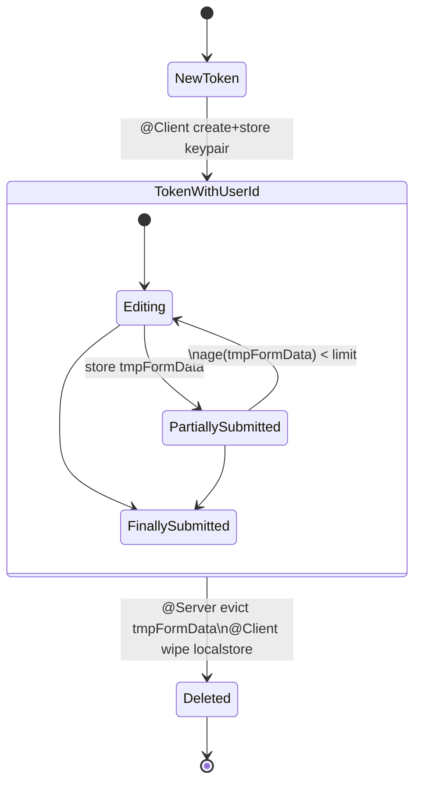

# Privacy friendly user sessions

```mermaid
stateDiagram-v2
  [*] --> NewToken
  NewToken --> TokenWithUserId : @Client create+store keypair

  state TokenWithUserId {
    [*] --> Editing
    Editing --> FinallySubmitted
    Editing --> PartiallySubmitted : store tmpFormData
    PartiallySubmitted --> Editing : \nage(tmpFormData) < limit
    PartiallySubmitted --> FinallySubmitted
  }

  TokenWithUserId --> Deleted : @Server evict tmpFormData\n@Client wipe localstore
  Deleted --> [*]
```
